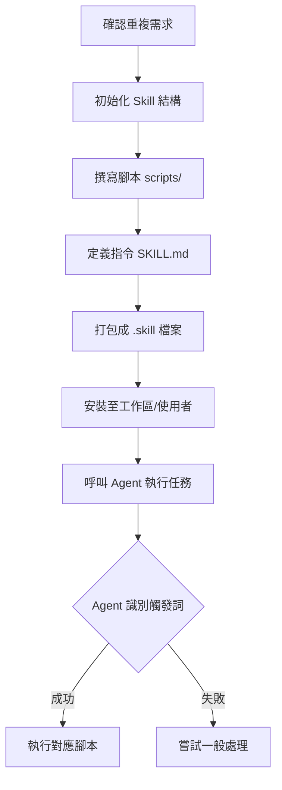

# AI Agent & Skills 開發手冊

本專案利用 Gemini CLI 打造自動化 AI Agent，並透過自定義 Skills 擴充功能（如：PChome 商品抓取）。本文件將引導你完成環境安裝、Skill 建立及使用流程。

## 1. 環境安裝與配置

### 安裝 Gemini CLI
請確保你的環境已安裝 Node.js，然後執行：
```bash
npm install -g @google/gemini-cli
```

### 初始化工作區
在專案根目錄執行以下指令以初始化環境：
```bash
gemini init
```

---

## 2. Skills 安裝流程

以 `pchome-scraper` 為例，當你獲得一個 `.skill` 檔案時，請依照以下步驟安裝：

1. **執行安裝指令**：
   ```bash
   gemini skills install pchome-scraper.skill --scope workspace
   ```
2. **重載 Skills** (在 Gemini CLI 互動介面中執行)：
   ```bash
   /skills reload
   ```
3. **驗證安裝**：
   ```bash
   /skills list
   ```

---

## 3. 建立自定義 Skills 流程

如果你想將一段重複執行的邏輯（如爬蟲、格式轉換）做成 Skill，請遵循以下步驟：

### 流程圖 (Skill 建立與呼叫)



### 具體操作步驟：

1. **初始化**：
   ```bash
   # 使用內建 skill-creator (若有) 或手動建立目錄
   # 結構需包含 SKILL.md, scripts/, references/, assets/
   ```
2. **實作內容**：
   - 在 `scripts/` 中放入你的 `.cjs` 或 `.py` 腳本。
   - 在 `SKILL.md` 的 YAML Frontmatter 中寫清楚 `name` 與 `description`（這是 Agent 辨識任務的關鍵）。
3. **打包與安裝**：
   ```bash
   # 打包
   node package_skill.cjs <path/to/folder>
   # 安裝
   gemini skills install your-skill.skill --scope workspace
   ```

---

## 4. 如何呼叫 Skills

當 Skill 安裝並重載後，你不需要記住複雜的腳本路徑，只需用自然語言對 Agent 下令：

*   **PChome 抓取**：
    *   「幫我抓取今天的 PChome 每日商品」
    *   「Run pchome-scraper」
*   **Playwright 輔助**：
    *   「幫我截圖這個網址：https://example.com」
    *   「幫我測試登入流程」

Agent 會根據 `SKILL.md` 中的描述，自動選擇最適合的工具來執行。

---

## 專案結構圖

```text
.
├── .gemini/               # Gemini 設定與安裝的 Skills
├── pchome-scraper/        # Skill 源碼 (開發中)
├── tests/                 # 測試腳本
├── pchome_daily_report/   # 抓取結果輸出
└── README.md              # 本說明文件
```
